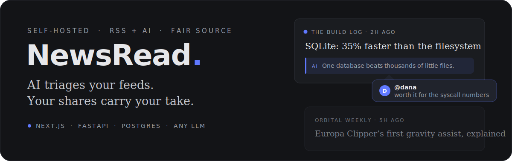
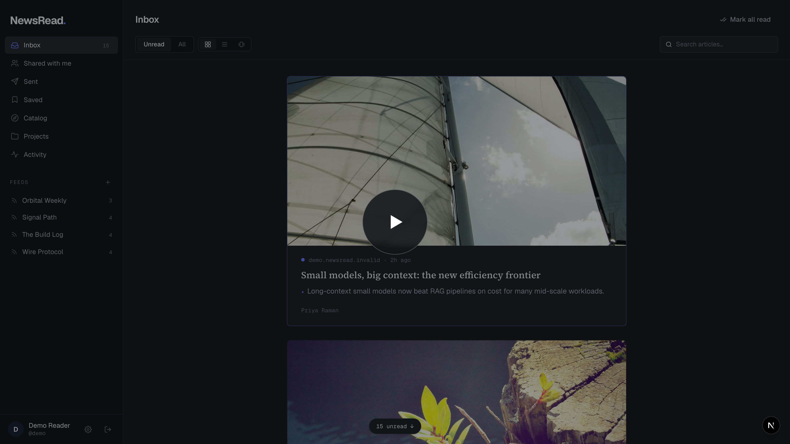
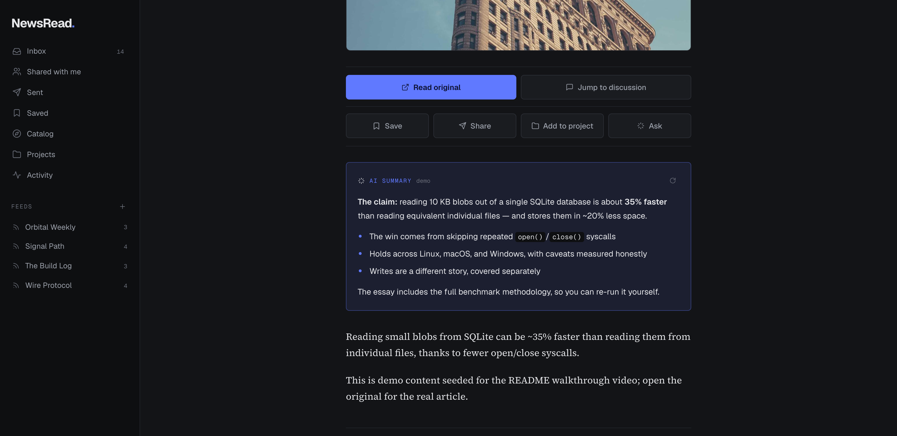
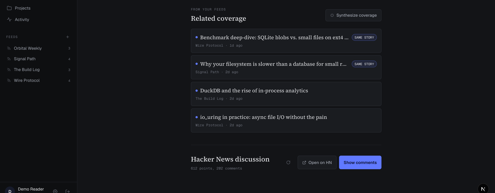
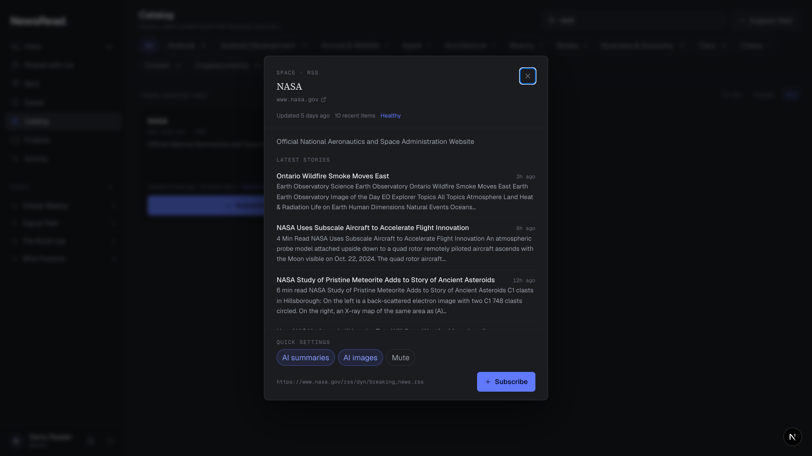

<p align="center">
  
</p>

<p align="center">
  <a href="LICENSE"></a>
  
</p>

<!-- DEMO VIDEO — GitHub only plays videos hosted on user-attachment URLs.
     To get the inline player: edit this README on github.com and drag
     docs/assets/newsread-demo.mp4 into this spot, replacing the poster link
     below. Until then, the poster links to the mp4, which GitHub plays on
     its file page. Regenerate the video anytime with
     .claude/skills/demo-video/scripts/run_demo.sh -->
<p align="center">
  <a href="docs/assets/newsread-demo.mp4">
    
  </a>
</p>
<p align="center">
  <sub><b>▶ Watch the 60-second tour</b> — scroll-to-read inbox · AI teaser summaries · related coverage · live Hacker News threads · one-click catalog subscribe</sub>
</p>

## What is NewsRead?

NewsRead is a source-available news reader built around a simple idea: **sharing an article should carry your context with it.** Subscribe to any RSS/Atom/JSON feed, let AI turn the flood into skimmable teasers, and when something matters, @mention a friend with a note — the recipient sees *why* you sent it, not just a raw link.

It's fully self-hosted: your server, your database, your choice of LLM (any OpenAI-compatible endpoint — OpenAI, vLLM, LiteLLM, Ollama).

## The reading loop

**Summaries that respect the source.** Every article gets AI teasers at three depths — a one-liner in the feed, a paragraph inline, a full Markdown summary in the article view — grounded in the full extracted text and built to send you to the original, not replace it. Ask the article follow-up questions and get answers that admit when the article doesn't say.

<p align="center">
  
</p>

**Coverage, connected.** Embedding search links each story to related coverage across your other feeds — near-duplicates get a "same story" badge — and can synthesize the cluster into one brief. Articles with a Hacker News thread show live points and comments, fetched by your browser straight from HN.

<p align="center">
  
</p>

**Feeds worth following.** A curated, health-checked catalog with live previews, semantic discovery, and smart feeds for any subreddit, Hacker News search, Google News topic, Medium tag, or Mastodon hashtag. Subscribe with per-feed AI settings in one click.

<p align="center">
  
</p>

## Quick start

Run everything (web app, API, worker, Postgres, Redis) with Docker:

```bash
cp .env.example .env   # optional — enables AI summaries and Q&A
docker compose up -d --build
```

Open [http://localhost:3000](http://localhost:3000), create an account, and add a feed — for example:

```
https://hnrss.org/newest.jsonfeed?points=100
```

A local install runs in **single-user mode** by default: registration closes once your account (the first one) exists, and the Slack/Teams integrations stay hidden. To try the social loop, open signups first — set `NEWSREAD_ALLOW_SIGNUP=true` in `.env` and `docker compose up -d backend` — then register a second account in a private window and share an article at it with a note. See the deployment modes section below for the full story.

## Everything it does

- **Read** — one inbox across all feeds; Telegram-style scroll-to-read that marks articles as you pass them; cards, list, and stories views; save-for-later; `j`/`k`/`enter`/`s`/`m` keyboard driving
- **Understand** — three-level AI summaries; per-article Q&A grounded in full text; related-coverage clustering with synthesis; HN discussions with coverage-aware summaries and comment drafting
- **Share** — @mention users with a note attached; "Shared with me" puts the commentary front and center; projects for shared collections; Slack & Teams integration
- **Discover** — hybrid search (Postgres full-text + pgvector) across articles and catalog; health-checked feed catalog with previews and semantic sort; smart topic feeds
- **Everywhere** — iOS & Android app (Expo) that points at your own server; reading-activity tracking; per-feed AI image generation with a monthly budget

**Planned:** tagging and shareable collections · push notifications (server side done; needs an EAS dev build) · plugin-based learning experiences (NotebookLM first)

## How it's built

| Layer | Technology |
|-------|-----------|
| Web | Next.js (App Router) + Tailwind CSS + SWR |
| API | Python / FastAPI, async SQLAlchemy, JWT auth |
| Jobs | ARQ worker on Redis — feed polling, summary pre-generation |
| Data | PostgreSQL + pgvector |
| Extraction | Scrapling (fetch) + trafilatura (article text) |
| LLM | Any OpenAI-compatible endpoint |
| Mobile | React Native (Expo Router) + SWR, bring-your-own-server |

<details>
<summary><b>Deployment modes</b></summary>

`NEWSREAD_DEPLOYMENT` tells the backend where it's running and picks safe
defaults for the feature flags; every flag can still be overridden
individually. Clients read the effective flags at runtime from
`GET /api/config`, so changing one is a backend restart — no frontend rebuild.

| Mode | Signups | Slack/Teams | Notes |
|------|---------|-------------|-------|
| `self_hosted` (default) | first account only | hidden | single-user instance |
| `staging` / `prod` | open | available | refuses to boot with the dev JWT secret |

Overrides: `NEWSREAD_ALLOW_SIGNUP` (with signups closed, registration still
works while the server has zero accounts, so the owner can sign up normally),
`NEWSREAD_MESSAGING_ENABLED` (integrations additionally need the Slack or Teams
credentials from `.env.example`), and `NEWSREAD_BROWSER_HISTORY_ENABLED`
(privacy-sensitive and deliberately opt-in in every deployment mode — see
[docs/browser-history-privacy.md](docs/browser-history-privacy.md) for what is
captured, the permission explanations, and operator notes before enabling).

Public deployments must set `NEWSREAD_DEPLOYMENT=prod` **and** a real
`NEWSREAD_JWT_SECRET` — prod and staging refuse to start with the dev default.

</details>

<details>
<summary><b>Local development</b></summary>

```bash
# Postgres + Redis only
docker compose up -d db redis

# Backend (http://localhost:8000, docs at /docs)
cd backend
uv sync
.venv/bin/uvicorn app.main:app --reload

# Feed-polling worker (optional in dev; the API fetches on subscribe)
.venv/bin/arq app.worker.WorkerSettings

# Frontend (http://localhost:3000)
cd frontend
npm install && npm run dev

# Mobile app (Expo — scan the QR with Expo Go, or press i/a for a simulator)
cd mobile
npm install && npx expo start
```

The mobile app asks for your server address on first launch — NewsRead is
self-hosted, so each install points at its owner's server. For local dev use
your machine's LAN IP (e.g. `http://192.168.1.20:8000`), not `localhost`
(which would be the phone itself). Push notifications need a development
build with an EAS project id; in Expo Go the app simply skips registration.

</details>

<details>
<summary><b>Database migrations</b></summary>

The schema is managed by Alembic (`backend/alembic/versions/`). Migrations run
automatically at startup — both the API and the worker call `init_db`, which
upgrades to head under an advisory lock; databases created before the Alembic
switch are stamped at the baseline on first boot. To add a schema change:

```bash
cd backend
# 1. Edit app/models.py, then generate a revision from the diff
uv run alembic revision --autogenerate -m "describe the change"
# 2. Review the generated file (autogenerate misses generated columns,
#    partial indexes, and data backfills), then restart the backend to apply
```

One-off data repairs belong in `db.ONE_SHOT_MIGRATIONS` (SQL) or
`db.ONE_SHOT_REPAIRS` (Python) — each named group runs exactly once per
database and must still be idempotent.

</details>

<details>
<summary><b>Catalog maintenance</b></summary>

Catalog cleanup is dry-run by default and always emits a reviewable JSON report:

```bash
cd backend
PYTHONPATH=. .venv/bin/python scripts/audit_catalog.py --report catalog-audit-report.json
PYTHONPATH=. .venv/bin/python scripts/audit_catalog.py --apply --remove-stale
PYTHONPATH=. .venv/bin/python scripts/embed_catalog.py
```

The audit retries transient failures, removes empty/invalid/undocumented feeds,
hides temporarily blocked feeds, refreshes descriptions and preview headlines,
and deactivates managed rows removed from the seed. A monthly GitHub workflow
opens a cleanup PR when the catalog changes.

Feed URLs that resolve to private or loopback addresses are rejected as an
SSRF guard. If your self-hosted instance subscribes to feeds on your own LAN,
set `NEWSREAD_BLOCK_PRIVATE_FEED_URLS=false`.

</details>

## License

NewsRead is [Fair Source](https://fair.io) software under the **Functional Source License (FSL-1.1-Apache-2.0)**. Each release automatically becomes **Apache 2.0** two years after it is published.

- ✅ Free to use, modify, and self-host — personally or inside your organization
- ✅ Free to redistribute and contribute back
- ❌ May not be sold or offered as a competing commercial product or service

See [LICENSE](LICENSE) for the exact terms.

## Documentation & contributing

- [Product Requirements Document (PRD)](docs/PRD.md)

Contributions are welcome once development begins — `CONTRIBUTING.md`, issue templates, and "good first issue" labels are on the roadmap.

---

<p align="center"><sub><i>Built for people who care about sharing what they read.</i></sub></p>
