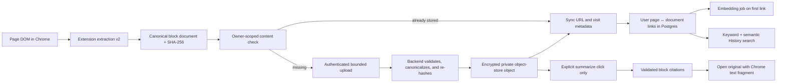

# Browser History follow-up plan: stored page content, semantic indexing, and cited summaries

> **Status:** Phase 3 implemented and awaiting review
>
> **Depends on:** PR #78 (Browser History) and PR #80 (deployment-mode default)
>
> **Scope:** Chrome extension, FastAPI backend/worker, Postgres, SeaweedFS/S3-compatible
> object storage, and the web History UI

## Goal

Turn Browser History from a searchable list of short page captures into a private,
content-addressed memory of pages:

- capture and extract page content in the user's browser, never by fetching the page
  from the NewsRead backend;
- capture a small lead image and/or favicon in the browser so History lists and the
  detail view show visual context without ever contacting visited origins;
- store large captured bodies in object storage rather than Postgres;
- deduplicate unchanged content without losing its URLs, visit dates, or counts;
- embed new content automatically so all eligible history becomes semantically searchable;
- generate a full, cited summary only after the user explicitly asks for it;
- let the user explicitly enable a Q&A conversation on a captured page and ask questions
  grounded in its stored content;
- open a cited passage on the original page and highlight it when Chrome can still
  match the captured text;
- skip known low-value and sensitive page shapes before they enter the outbox.

## What already exists

The merged feature gives us a strong base:

- extraction already happens in `extension/src/content.ts`; the backend does not scrape
  history URLs;
- `browser_history_pages` is unique on `(user_id, url_hash)`, so revisiting the same
  normalized URL updates one page record;
- the extension and backend already compute content hashes, but the current hash includes
  title and hostname and the full 6,000-character body is still stored on the page row;
- domain exclusions and metadata-only rules are enforced in both extension and backend;
- a worker already generates history embeddings, but it polls page rows in batches rather
  than enqueueing each new content object immediately;
- search is owner-scoped and combines Postgres full-text search with pgvector;
- there is no History detail view, stored history summary, or citation contract.

The follow-up should migrate these mechanisms rather than introduce a second history
pipeline.

## Recommended product decisions

### Deduplication scope

Deduplicate content **within one user**, not globally across users.

- A private document is unique on `(user_id, content_hash)`.
- Object keys are also user-scoped, for example
  `users/{user_id}/history/sha256/{prefix}/{content_hash}.json.zst`.
- Two users who capture identical bytes do not share a database document, object key,
  embedding, or summary.
- The SHA-256 hash proves that uploaded bytes match the claimed content. It is not an
  authorization mechanism; no API accepts a hash without also resolving an authenticated
  user-owned document.

This still removes the common duplicates—repeat visits, tracking/canonical URL variants,
and the same article reached from multiple places—without creating a cross-user existence
oracle or accidental data-sharing path.

**Decided (evaluated and rejected: cross-user dedup).** Storing identical content once
globally was considered and rejected, for two reasons beyond the existence oracle:

- it is incompatible with the per-user encryption decision — the same content encrypted
  under two users' data keys produces different ciphertext, so there is nothing shared to
  deduplicate. The standard workaround, convergent encryption (deriving the object key
  from the content hash), lets an attacker with bucket access confirm whether a document
  they already possess was captured by anyone — acceptable for public articles, but
  weakest exactly for the sensitive private pages the encryption gate exists to protect;
- the savings are small: captured documents compress to roughly 20–30 KB, so even
  extensive cross-user overlap costs a few gigabytes, modest for object storage, while global
  dedup requires refcounted garbage collection and complicates account deletion.

Hash verification still provides the injection protection regardless of scope: the
backend recomputes SHA-256 from uploaded bytes and rejects mismatches, so no user can
plant content under a hash whose bytes they do not actually possess.

### Result identity

Keep URL history and content identity separate:

- a **page** represents a normalized URL and its aggregate visit history;
- a **document** represents one extracted content version;
- a page can point to several documents over time if its content changes;
- one document can be linked to several pages if different URLs have identical content.

History search should return one result per document version, with its URLs and visit span
shown as locations. Repeated unchanged visits update the existing link and do not upload,
embed, or summarize the content again.

**Decided:** the default reverse-chronological browsing list stays page/visit-centric,
matching the Chrome-history mental model of what was visited and when. Only search results
collapse duplicates to one document with its locations listed.

**API shape:** the browsing list endpoint keeps its page-list response. Search returns a
discriminated union of result items: `{"type": "document", ...}` carries the document id,
excerpt, and locations; `{"type": "page", ...}` covers legacy rows during the dual-read
window and metadata-only pages permanently (they never gain documents). One typed union
lets the frontend render both variants without a separate dual-read endpoint.

### Legacy captures

**Decided:** no backfill of pre-existing captures. Old captures are flat 6,000-character
truncated text under the old hash scheme; documents, summaries, and citations built from
them would be poor. They stay on the legacy page-text path during the dual-read window,
and only pages revisited after extension v2 ships enter the new pipeline (which upgrades
them in place). Accepted tradeoff: pages never revisited before Phase 6 drops the legacy
columns become metadata-only — title/hostname search keeps working, body search and
embeddings for them are lost.

### Encryption at rest

**Decided:** app-level per-user encryption, satisfying the locked default-on gate that
history page text must be encrypted at rest.

- The backend encrypts every object (documents and images) before writing to object storage
  and decrypts only inside the owner-scoped storage service. SeaweedFS only ever sees ciphertext,
  so a bucket, disk, or backup leak exposes nothing readable.
- Use envelope encryption. This is new code: the existing messaging encryption is flat
  Fernet with a derived key, not envelope encryption, and is not reused. A random
  per-user data key encrypts objects with AES-256-GCM; the data key is stored wrapped by
  a master key from backend configuration, so master-key rotation rewraps data keys, not
  objects.
- Add a `browser_history_user_keys` table: `user_id`, `data_key_version`,
  `wrapped_data_key`, `wrap_alg`, `wrapping_key_version` (which master-key generation
  wrapped this row), `created_at`, `retired_at`; unique on `(user_id, data_key_version)`.
  Master-key rotation bumps `wrapping_key_version` by rewrapping rows without touching
  objects; data-key rotation adds a new `data_key_version` used for future objects.
- Define the encrypted-object format explicitly: a small header (magic, format version,
  `data_key_version`, 12-byte random nonce) followed by the AES-GCM ciphertext and tag.
  Bind `{object_type, user_id, object_hash}` as GCM associated data — `object_type` is
  `document` or `image` — so one format covers both stores and a ciphertext cannot be
  replayed under another user, another hash, or the other object type.
- V2 ingest never writes plaintext bodies to Postgres: `browser_history_pages.text` is
  frozen at Phase 2 for pre-v2 rows only and dropped in Phase 6 — the point at which the
  encrypted-at-rest gate is fully satisfied.
- Scope statement: encryption covers the stored bodies. Derived artifacts — `search_tsv`
  lexemes, excerpts, embeddings, and summaries — remain plaintext in Postgres by design;
  they are what make search and the UI work. Document this plainly in the privacy guide.

### Exclusions

Do not exclude all of `google.com`; that would also hide useful Google-hosted content.
Add a visible, versioned default policy for exact low-value page shapes, then layer the
existing user domain rules above it:

- search-engine landing and results pages such as exact Google `/` and `/search` routes;
- sign-in/account chooser routes for known identity providers;
- pages that are not HTML, have no meaningful `article`/`main` content, and fall below a
  minimum useful-text threshold;
- NewsRead itself, browser-internal URLs, private-network URLs, downloads, and incognito,
  which are already excluded;
- pages with an explicit NewsRead opt-out meta tag, if site owners want one.

System defaults must be shown in Settings and individually overridable. Both extension and
backend enforce the same policy revision. Avoid arbitrary user-supplied regular expressions;
use structured host, exact-path, and path-prefix matchers.

### Object storage

Use a small S3-compatible storage abstraction and run Apache-2.0-licensed
[SeaweedFS](https://github.com/seaweedfs/seaweedfs) in local Docker Compose. Production
deployments can point the same abstraction at SeaweedFS or another S3-compatible service.

- The bucket is private and is never exposed directly to the frontend or extension.
- The backend accepts bounded authenticated uploads and streams them into object storage.
- SeaweedFS credentials stay only in backend/worker configuration.
- Object downloads go through owner-checked backend services; object keys and presigned
  URLs are not returned in normal APIs.
- A garbage-collection worker deletes unreferenced objects after a grace period because
  Postgres and object storage cannot share one transaction.

Direct browser-to-object-storage presigned uploads can be evaluated later if upload traffic becomes
large. It is not the first implementation because it requires a public object-store
endpoint, CORS, quarantine/finalization, and a second integrity-verification step.

## Target architecture



## Capture document format

Replace the flat 6,000-character `text` field with a versioned, canonical JSON document.
The object contains text only—never raw page HTML or executable markup.

Suggested shape:

```json
{
  "schema_version": 1,
  "extraction_version": "history-dom-v2",
  "content_type": "article",
  "language": "en",
  "blocks": [
    {
      "id": "b0001",
      "kind": "heading",
      "text": "Example heading"
    },
    {
      "id": "b0002",
      "kind": "paragraph",
      "text": "Exact visible paragraph text..."
    }
  ]
}
```

The URL, title, hostname, canonical hint, visit timestamps, and browser name remain
Postgres metadata; they are not part of the content hash. This allows identical article
content at different URLs to deduplicate.

Canonicalization rules must be implemented and tested in both TypeScript and Python:

- Unicode normalization and control/bidi character removal;
- deterministic whitespace handling;
- deterministic key/block order and UTF-8 serialization;
- bounded block count, block length, total characters, and uncompressed bytes;
- a version prefix in the digest input, for example
  `sha256("newsread-history-content-v1\0" + canonical_bytes)`.

The extension hash is an upload/dedup hint. The backend parses the upload, enforces limits,
recreates the canonical bytes, recomputes the digest, and rejects a mismatch. It must never
trust a client-supplied hash or object key.

## Image and favicon capture

Capture visual context under the same rules as text: extracted by the extension, stored as
private objects, never hotlinked or refetched by the backend.

- The extension picks one **lead image** candidate — `og:image`/`twitter:image` when that
  image is already loaded in the DOM, otherwise the first sufficiently large visible
  `` inside the extracted content — plus the page **favicon**.
- Candidates are re-encoded through a canvas to a bounded raster thumbnail, for example
  lead image ≤ 640px and ≤ 200 KB as WebP/JPEG, favicon ≤ 64px and ≤ 32 KB as PNG.
  Re-encoding strips EXIF metadata and normalizes the bytes; SVG is never uploaded.
- Cross-origin images without CORS headers taint the canvas and cannot be exported. When
  re-encoding fails, fall back from lead image to favicon to no image. A missing image is
  normal; the UI keeps its hostname/letter fallback.
- Images are content-addressed like documents: unique per `(user_id, image_hash)`,
  uploaded once through an authenticated bounded endpoint, and stored in the same private
  bucket under user-scoped keys. The backend verifies magic bytes, enforces byte and
  pixel-dimension caps **before** full decode, decodes to confirm a valid raster, and
  recomputes the hash.
- The History UI must never render third-party image URLs directly — viewing history must
  not contact visited origins. Thumbnails and favicons are served only through
  owner-scoped backend endpoints with private cache headers. The backend does not proxy
  or refetch remote images.
- Lead images hang off the **document**, since a new content version may bring a new
  image; favicons attach to the page and dedupe naturally by hash across a site's pages.
- Image objects join the same deletion outbox and unreferenced-object garbage collection
  as documents.

## Data model

Add the following tables/relations in a new Alembic migration.

### `browser_history_documents`

One logical private content version.

| Column | Purpose |
|---|---|
| `id` | Internal document id |
| `user_id` | Mandatory owner scope |
| `content_hash` | SHA-256 of canonical extracted blocks |
| `object_key` | Server-generated user-scoped object-store key |
| `storage_status` | `pending`, `ready`, `failed`, or `deleting` |
| `byte_size` / `character_count` | Quotas and diagnostics |
| `text_excerpt` | Small sanitized preview kept in Postgres |
| `search_tsv` | Stored weighted lexemes; no full body in Postgres |
| `extraction_version` | Re-extraction/backfill visibility |
| `created_at` / `updated_at` | Audit timestamps |

Unique constraint: `(user_id, content_hash)`.

`search_tsv` preserves full-body keyword search without keeping the raw body in Postgres.
The current full-body `ILIKE` fallback becomes title/hostname/excerpt fallback; full-body
matching uses the tsvector.

### `browser_history_page_documents`

Links URL history to content versions.

| Column | Purpose |
|---|---|
| `page_id` / `document_id` | Private URL-to-content relation |
| `first_seen_at` / `last_seen_at` | When this content version was seen at this URL |
| `captured_at` | Capture timestamp |

Unique constraint: `(page_id, document_id)`.

**Version retention (decided):** the existing retention cron also removes page–document
links whose `last_seen_at` exceeds the user's retention window. A document left with no
remaining links is deleted — its summary, conversation, and embedding rows cascade, and
its object enters the deletion outbox. If a page's `current_document_id` link expires,
the page falls back to its newest remaining link, or to metadata-only when none remain.

### `browser_history_images`

Private captured thumbnails and favicons, content-addressed per user.

| Column | Purpose |
|---|---|
| `id` | Internal image id |
| `user_id` | Mandatory owner scope |
| `image_hash` | SHA-256 of the re-encoded bytes |
| `object_key` | Server-generated user-scoped object-store key |
| `storage_status` | Same lifecycle as documents |
| `format` / `width` / `height` / `byte_size` | Validation results and quotas |
| `source_host` | Origin hostname only — full source URLs may carry signed or private query parameters and are never stored |
| `created_at` | Audit timestamp |

Unique constraint: `(user_id, image_hash)`. The image row carries no role: the role lives
on the relationship — nullable `lead_image_id` on `browser_history_documents` and nullable
`favicon_image_id` on `browser_history_pages` — so one image row can serve both roles
without conflicting with the hash uniqueness. An image referenced by no document or page
is garbage-collected like an unlinked document.

Add `current_document_id` to `browser_history_pages`. Keep URL/title/hostname and visit
aggregates there, then remove `text`, `content_hash`, and the generated page-level
`search_tsv` only after the dual-read migration is complete.

### `browser_history_embeddings`

Move ownership from `page_id` to `document_id`. Prefer chunk rows:

- `(document_id, chunk_index, model)` unique;
- `input_hash`, vector, and `embedded_at`;
- chunk metadata contains block start/end ids, not raw text.

Search ranks a document by its best matching chunk, then fuses the document list with
keyword results. A document linked to three URLs is embedded once.

### `browser_history_summaries`

Store summaries separately from documents so generation remains optional:

- `document_id`;
- `model`, `prompt_version`, and `input_hash`;
- `status`: `queued`, `generating`, `ready`, or `failed`;
- Markdown summary;
- validated citation JSON;
- `generated_at` and a safe error code.

Use one current summary per `(document_id, model, prompt_version, input_hash)`. A second
URL pointing to the same document reuses that user's existing summary.

### Object deletion outbox

Add a small table containing object keys awaiting deletion. Deleting history commits the
database change and outbox record together; a worker idempotently deletes the object and
then the outbox row. This prevents silent object leaks after partial failures.

## Upload and sync protocol

Keep extension tokens restricted to the History sync surface.

1. The extension extracts and canonicalizes the page, computes `content_hash`, and stores
   the object plus visit metadata in IndexedDB.
2. It calls an owner-scoped content-status endpoint in a bounded batch.
3. For each missing hash, it uploads the canonical document through an authenticated
   endpoint. The backend:
   - streams with compressed and uncompressed size limits;
   - validates JSON and text-only blocks;
   - canonicalizes and recomputes SHA-256;
   - generates the user-scoped object key itself;
   - stores with create-if-absent semantics;
   - creates or repairs the private document row.
4. The existing history sync sends URL/title/visit metadata plus the verified
   `content_hash`. It upserts the page and page-document link; the **first** link for a
   document is what enqueues its embedding. Ready-but-unlinked uploads (a sync that never
   completed) are garbage-collected without ever spending embedding quota.
5. IndexedDB removes the queued record only after both content upload and metadata sync
   are acknowledged.

Suggested endpoints:

- `POST /api/history/sync/content-status`
  - extension-authenticated list of hashes;
  - returns only whether each hash exists for this connection's user.
- `PUT /api/history/sync/content/{content_hash}`
  - extension-authenticated, idempotent upload;
  - rejects hash mismatch, invalid schema, decompression bombs, and over-limit content.
- `PUT /api/history/sync/image/{image_hash}`
  - extension-authenticated, idempotent bounded image upload;
  - rejects non-raster bytes, over-limit dimensions/bytes, and hash mismatch;
  - the content-status endpoint covers image hashes too, so unchanged images are never
    re-uploaded.
- evolve `POST /api/history/sync`
  - replaces inline `text` with optional verified `content_hash`;
  - adds optional verified lead-image and favicon hashes;
  - keeps metadata-only imports valid with no hash.

Do not add any backend URL-fetch fallback. Missing or invalid browser content leaves a
metadata-only page and a retryable extension outbox entry.

## Immediate semantic indexing

Embedding is automatic; summarization is not.

- A ready document enqueues `embed_history_document(document_id)` when its first
  page–document link commits — not at upload — so abandoned uploads never consume
  embedding quota.
- The job loads the object through the owner-scoped storage service, chunks its blocks,
  creates vectors, and stores them against the document.
- A scheduled catch-up job continues to find missing, stale-model, and failed embeddings,
  so Redis or provider downtime self-heals.
- Metadata-only Chrome history imports remain keyword-searchable by title/domain but show
  “content not captured” and cannot receive a body embedding or summary until revisited.
- Search must never wait synchronously for an embedding. New pages appear immediately via
  metadata/keyword search and join semantic results when the job completes.
- Model changes re-embed documents once, not once per URL.

Add embedding backlog age/count and per-document state to existing operational metrics.
Apply per-user quotas/rate limits because automatic embeddings can create provider cost.

## History detail and lazy summary

Add `/history/documents/{document_id}` as an article-like detail view. Detail, content,
summary, and Q&A are all addressed by **document id**: search returns document versions,
and a page-centric route could not open an old version unambiguously. Browsing list rows
link to the page's current document, and the detail view lists the page's other versions
when they exist. The view shows:

- title, hostname, first/last visit, visit count, and all known locations — visit counts
  are URL totals from the existing absolute per-connection counters and must be labeled
  as such; per-version data is limited to the first/last-seen span on the page–document
  link, since per-version counting would change the extension's counter contract;
- the captured lead image as an article-style hero and the favicon next to the hostname;
  the History list shows the favicon (and optionally a small thumbnail) per row;
- a small captured-text preview and an “Open original” action;
- an AI Summary card using the existing Markdown visual language;
- a clear **Generate summary** button when no current summary exists;
- loading, failure/retry, too-short, content-missing, and model-unconfigured states.

The detail `GET` must be side-effect free. It must not call an LLM, enqueue generation, or
implicitly summarize on mount.

Suggested normal-user endpoints:

- `GET /api/history/documents/{document_id}`
  - owner-scoped detail, locations (linked pages and visit spans), other versions,
    preview, embedding state, and summary state.
- `GET /api/history/documents/{document_id}/content`
  - owner-scoped, bounded plain-text/block response for the detail view.
- `GET /api/history/images/{image_id}`
  - owner-scoped image bytes with private cache headers; the only way the UI loads
    captured thumbnails and favicons.
- `POST /api/history/documents/{document_id}/summarize`
  - the only normal path that starts summary generation;
  - idempotently returns a ready cached summary or queues one generation;
  - supports an explicit `force=true` regeneration action.
- `GET /api/history/documents/{document_id}/summary`
  - returns state, Markdown, model, and citations for polling/SWR.

Use an ARQ job rather than holding the request open for the LLM. Record usage as a distinct
`history_summary` feature and apply the same user/server AI configuration resolution as
article summaries.

## History page Q&A

Reuse the existing Q&A agent (`backend/app/qa_agent.py`, which already has article,
project, and discussion modes) rather than building a second agent. Add a history mode
with its own instruction set:

- the Q&A panel on `/history/documents/{document_id}` is off by default; a visible
  **Ask about this page** action enables it, and rendering the detail view never creates
  a conversation or calls the model;
- the agent is grounded in the captured canonical blocks, loaded through the owner-scoped
  storage service — never by refetching the history URL from the backend;
- the instructions treat captured blocks as untrusted quoted material exactly like the
  summary prompt: ignore instructions found inside them and answer from them;
- `web_search`/`web_extract` stay available under the same configuration as article Q&A —
  they are user-directed lookups, distinct from the ingestion pipeline's no-backend-scraping
  rule — but nothing the agent fetches is ever written into history documents or search;
- conversations persist per `(user, document)` with the usual owner scope, mirroring
  article conversations; a new content version starts a fresh conversation, and the old
  one stays readable on the old version's detail view;
- usage is recorded as a distinct `history_qa` feature with the same user/server AI
  configuration resolution;
- metadata-only pages (no captured document) show "content not captured" and do not offer
  Q&A;
- as a follow-up, answers can cite block ids through the same citation contract as
  summaries so Q&A answers deep-link into the original page; not required for the first
  release.

Suggested endpoints, mirroring the article Q&A shape:

- `GET /api/history/documents/{document_id}/qa` — owner-scoped conversation history;
- `POST /api/history/documents/{document_id}/qa/stream` — SSE streaming answer; the only
  path that invokes the agent.

## Citation contract

Captured page text is hostile input. Do not ask the model to invent URLs, selectors, or
free-form quotes.

1. The summarizer receives numbered block ids and is instructed to cite them in structured
   output.
2. The model returns Markdown plus citation references such as `b0012`.
3. The backend rejects unknown block ids and builds the public citation object from the
   stored block itself.
4. For each cited block, the backend derives a short exact target plus optional
   prefix/suffix context. The model never controls these values.
5. The frontend renders citation markers as buttons/links; captured content remains plain
   text and summary Markdown goes through the existing sanitized renderer.

Example API citation:

```json
{
  "id": 3,
  "block_id": "b0012",
  "label": "3",
  "quote": "A short exact passage from the captured block",
  "prefix": "optional preceding context",
  "suffix": "optional following context",
  "source_document_id": 481,
  "source_page_id": 92,
  "url": "https://example.com/article"
}
```

The stored citation persists only the block anchor: `block_id`, quote, and context.
`source_page_id` and `url` are resolved at read time from the document's current
page–document links, preferring the location with the most recent `last_seen_at`; if
every link has expired, the citation renders without an open action. Resolving at read
time keeps cached summaries valid when a document's locations change.

The summary prompt must explicitly treat every captured block as untrusted quoted material,
ignore instructions found inside it, and answer only from those blocks. Add prompt-injection
fixtures and citation-validation tests.

## Chrome jump and highlight

Chrome supports user-initiated links to text with the
[`#:~:text=` Text Fragment syntax](https://developer.chrome.com/blog/new-in-chrome-80).
The format supports exact text plus optional prefix/suffix context; matching browsers scroll
to and highlight the passage. The underlying
[URL Fragment Text Directives specification](https://wicg.github.io/scroll-to-text-fragment/)
also documents the security restrictions.

Implement this in two levels:

### Level 1: native Text Fragment

- Build the fragment from the backend-validated exact quote and context.
- Percent-encode directive delimiters correctly.
- Open only on a direct user click, in a new `noopener,noreferrer` tab.
- Preserve a safe author fragment when possible.
- If the page changed, the passage is in an iframe, the site opts out, or no exact match
  exists, Chrome opens the page normally without a highlight.

### Level 2: extension-assisted fallback

The extension already has a content script on captured pages. Add a narrowly scoped message
flow from the exact paired NewsRead origin:

- a citation click sends the target URL and validated anchor to the extension;
- the background opens the tab and records a short-lived pending anchor for that tab;
- the target content script finds the normalized exact quote, scrolls it into view, and
  applies a temporary highlight;
- messages from any origin other than the paired NewsRead origin are rejected;
- a miss degrades to the normal opened page and shows no injected permanent markup.

The fallback should use DOM `Range`/safe text APIs from an isolated content script, never
`innerHTML`. Chrome documents that
[content scripts can read and modify page DOM in an isolated world](https://developer.chrome.com/docs/extensions/develop/concepts/content-scripts).

Ship Level 1 first. Level 2 is useful for client-rendered pages and sites where native text
fragments are unreliable, but is not required for the initial cited-summary release.

## SeaweedFS and configuration

Add to `docker-compose.yml`:

- a pinned `chrislusf/seaweedfs` service running `weed mini` with a persistent volume;
- an internal health check;
- bucket creation at startup through SeaweedFS's `S3_BUCKET` configuration;
- backend and worker dependencies on healthy object storage;
- no public bucket and no public console in the default profile.

Add configuration with safe startup validation:

- `NEWSREAD_OBJECT_STORE_ENDPOINT`;
- `NEWSREAD_OBJECT_STORE_ACCESS_KEY`;
- `NEWSREAD_OBJECT_STORE_SECRET_KEY`;
- `NEWSREAD_OBJECT_STORE_BUCKET`;
- `NEWSREAD_OBJECT_STORE_REGION`;
- `NEWSREAD_OBJECT_STORE_SECURE`;
- `NEWSREAD_HISTORY_ENCRYPTION_MASTER_KEY` for wrapping per-user data keys;
- `NEWSREAD_HISTORY_ENCRYPTION_WRAPPING_KEY_VERSION` and a temporary
  `NEWSREAD_HISTORY_ENCRYPTION_PREVIOUS_MASTER_KEYS` JSON keyring for safe rotation;
- upload size, per-user stored-byte, and retention limits.

Use a least-privilege service credential restricted to the History bucket/prefix. Production
docs should cover TLS, encryption at rest, backups, key rotation, lifecycle/garbage
collection, and the fact that deleting the Postgres row alone is not sufficient.

## Migration and rollout

Use a dual-read/capability migration rather than one destructive cutover.

### Phase 1 — contracts and storage foundation

- [x] Freeze canonical capture fixtures shared by TypeScript and Python tests.
- [x] Add the S3-compatible storage service, SeaweedFS Compose service, health check, and
      configuration validation.
- [x] Implement per-user envelope encryption in the storage service; verify bucket bytes
      are ciphertext.
- [x] Add document, page-document, summary, chunk-embedding, and object-deletion-outbox
      tables.
- [x] Add an object-store fake for unit tests and a SeaweedFS integration test profile.
- [x] Keep all existing API/UI behavior unchanged.

### Phase 2 — extension extraction v2 and owner-scoped dedup

- [x] Extract structured visible text blocks in the browser with a larger bounded body.
- [x] Add exact-path/path-prefix built-in exclusions and low-value-page heuristics.
- [x] Add versioned canonicalization and local SHA-256.
- [x] Add IndexedDB object records and the content-status/upload retry state machine.
- [x] Capture, canvas-re-encode, and upload bounded lead images and favicons with
      taint/CORS fallbacks; validate rasters and caps on the backend.
- [x] Recompute and verify every digest on the backend.
- [x] V2 captures write encrypted documents only and never populate
      `browser_history_pages.text`; the legacy column is frozen read-only for pre-v2 rows.
- [x] Convert old-extension inline text server-side into an encrypted single-block
      legacy-extraction document (summaries/Q&A/citations disabled, like other legacy
      documents) for one compatibility window; after the window, old clients become
      metadata-only.
- [x] Materialize document `search_tsv` at ingest, and roll Phases 2–3 out behind the
      same server capability revision so new captures never lose body keyword search.

Acceptance: repeated unchanged visits and identical content at two URLs produce one private
document, one stored object, and distinct URL/visit links.

### Phase 3 — eager embedding and document-centric search

- [x] Enqueue an embedding job when a ready document receives its first page–document
      link; ready-but-unlinked uploads remain inert.
- [x] Chunk by captured block boundaries and store document-level vectors.
- [x] Switch keyword search to the document `search_tsv` materialized at ingest in
      Phase 2; no full body persists in Postgres.
- [x] Update hybrid search to return documents with locations and owner scope on every leg.
- [x] Preserve scheduled stale/missing-vector catch-up.
- [x] No backfill of legacy captures (decided): pre-v2 pages stay on the legacy path and
      enter the pipeline only when revisited.

Acceptance: every eligible ready document is queued without a summary click; duplicate URLs
do not create duplicate embeddings; provider outages leave retryable keyword-searchable
documents.

### Phase 4 — detail view, explicit lazy summaries, and page Q&A

- [ ] Add owner-scoped detail/content/summary APIs.
- [ ] Add the History detail page and article-style summary component.
- [ ] Show favicons in History list rows and the lead image on the detail view, loaded
      only through the owner-scoped image endpoint.
- [ ] Require a visible user click to create a summary; verify that navigation and preview
      never enqueue it.
- [ ] Generate structured block citations and reject invalid model output.
- [ ] Cache by document input hash, model, and prompt version.
- [ ] Track `history_summary` usage, failures, and retries.
- [ ] Add owner-scoped history Q&A endpoints reusing the existing Q&A agent with a
      history instruction set grounded in stored blocks.
- [ ] Gate the Q&A panel behind an explicit enable action and track `history_qa` usage;
      verify zero agent calls before it.

Acceptance: a captured page can be viewed without an LLM call; one click generates a cited
summary; another URL with the same content reuses that user's summary; enabling Q&A and
asking a question is the only path that invokes the agent.

### Phase 5 — citation navigation

- [ ] Generate and test native Text Fragment links, including prefix/suffix encoding.
- [ ] Show the captured citation passage in a tooltip/popover before navigation.
- [ ] Add the optional extension-assisted fallback with paired-origin and sender checks.
- [ ] Test changed pages, repeated phrases, SPAs, iframes, RTL text, and no-match behavior.

Acceptance: supported pages scroll to and highlight the cited text; all failure cases still
open the correct original URL safely.

### Phase 6 — remove legacy bodies and harden operations

- [ ] Compare legacy and new search results during the dual-read window.
- [ ] Drop the frozen legacy body/content-hash/page-vector columns in a later migration;
      never-revisited pages become metadata-only per the legacy-captures decision.
- [ ] Enable object garbage collection and verify delete-page/domain/all/account flows.
- [ ] Add quotas, backlog/storage dashboards, and operator alerts.
- [ ] Update privacy, extension permission, backup, and restore documentation.
- [ ] Roll out behind a second server capability flag; old extensions are supported for
      one compatibility window via server-side conversion of inline text into encrypted
      legacy documents, then become metadata-only clients.

## Required tests

### Security and isolation

- a user cannot probe, attach, fetch, summarize, cite, or search another user's hash;
- the same hash captured by two users creates independent private documents/objects;
- a claimed hash with different bytes is rejected and never becomes `ready`;
- path traversal, malformed object keys, invalid Unicode, excessive nesting, too many
  blocks, oversized compressed bodies, and decompression bombs are rejected;
- image uploads that are not decodable rasters, are SVG, exceed byte or pixel-dimension
  caps, or claim a mismatched hash are rejected; dimension caps apply before full decode;
- page text and summary output cannot inject HTML, script, Markdown URLs, or extension
  messages;
- content-status does not disclose global object existence;
- objects read directly from the bucket are ciphertext; a wrong or missing user data key
  cannot decrypt another user's objects; master-key rotation rewraps data keys without
  rewriting objects; AAD rejects presenting a document ciphertext as an image or vice
  versa;
- extension citation messages are accepted only from the exact paired NewsRead origin and
  a user gesture.

### Deduplication and consistency

- same URL + same hash updates visits only;
- same URL + new hash creates a new version link;
- different URLs + same hash reuse one user document;
- upload retry, sync retry, and concurrent uploads are idempotent;
- object upload without DB finalization is garbage-collected;
- DB deletion with temporary object-store failure remains in the deletion outbox and retries;
- retention and account deletion remove private rows, summaries, vectors, and eventually
  unreferenced objects;
- version retention cascades: an expired page–document link removes the link, an unlinked
  document (or image) is deleted with its dependents, its object enters the outbox, and
  `current_document_id` is repaired or cleared.

### AI behavior

- embedding is queued only when a ready document gains its first page–document link and
  never waits for summary generation; ready-but-unlinked uploads are garbage-collected
  without embedding;
- embedding failure does not block sync or keyword search;
- detail `GET`, list rendering, link hover/prefetch, and content preview make zero LLM calls;
- summarize POST is idempotent under double-click/concurrent requests;
- history Q&A answers only from stored blocks plus its explicit web tools; injected
  instructions in captured text do not change agent behavior;
- Q&A endpoints are owner-scoped and unavailable for metadata-only pages;
- fabricated/unknown citation block ids fail safely;
- captured prompt-injection instructions are treated as source text;
- summaries and embeddings are invalidated when content, model, extraction policy, or prompt
  version requires it.

### Browser behavior

- default exclusions cover Google landing/search shapes without excluding all Google-hosted
  pages;
- user overrides and server policy revisions purge matching queued objects;
- extraction works for `article`, `main`, body fallback, dynamically rendered text, and RTL;
- a cross-origin lead image without CORS falls back to favicon, then to no image;
- rendering History list and detail pages issues zero requests to visited origins;
- native Text Fragment links encode punctuation and context correctly;
- extension fallback highlights the exact occurrence and never modifies a non-target tab.

## Success metrics

- duplicate-content ratio: captures received vs new private documents created;
- bytes kept out of Postgres and object-store bytes per user;
- upload dedup hit rate and hash-validation failures;
- image capture rate and fallback distribution: lead image vs favicon vs none;
- time from successful upload to embedding ready;
- semantic-search coverage and embedding backlog age;
- summary generation rate per detail view, proving summaries remain opt-in;
- Q&A enablement and questions per detail view, proving Q&A remains opt-in;
- citation validation rate and highlight success/fallback rate;
- object deletion outbox age and orphan count;
- sync payload size, retry rate, and extension outbox age.

## Explicit non-goals

- backend scraping or refetching history URLs;
- cross-user document, embedding, or summary reuse;
- automatically summarizing every captured page;
- storing or rendering raw captured HTML;
- hotlinking third-party image URLs in the UI or proxying/refetching remote images
  through the backend;
- promising that every original page can still be highlighted after it changes;
- cross-history Q&A ("ask questions over everything I've read") — per-page Q&A only in
  this follow-up;
- backfilling pre-v2 captures into documents, summaries, or embeddings;
- per-version visit counters — the extension's absolute URL-level counter contract stays
  unchanged;
- replacing the existing Article/Imported pipeline with History documents;
- exposing SeaweedFS directly as a public content server.
